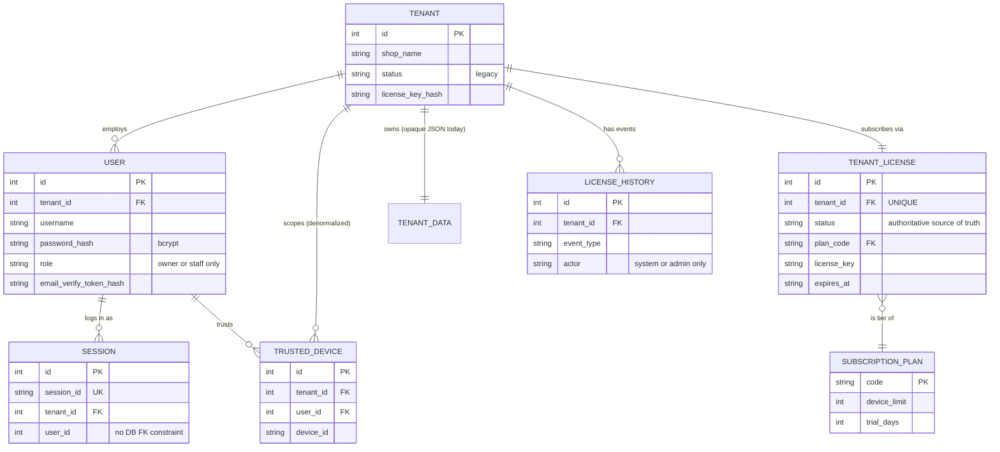
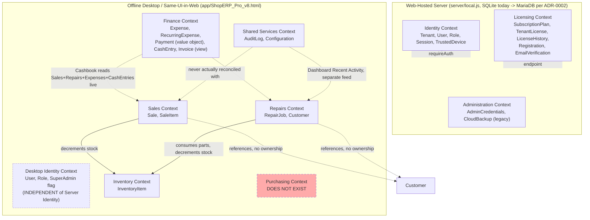
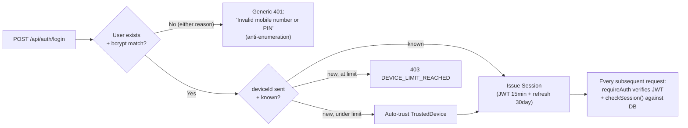
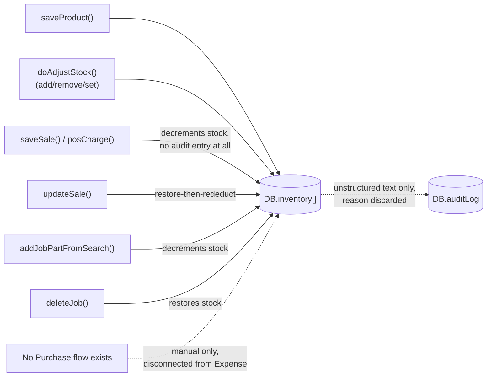
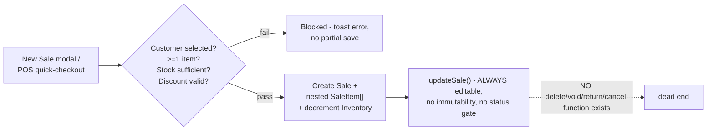
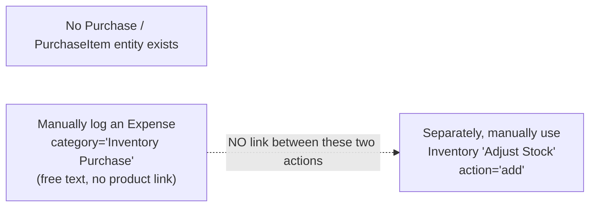
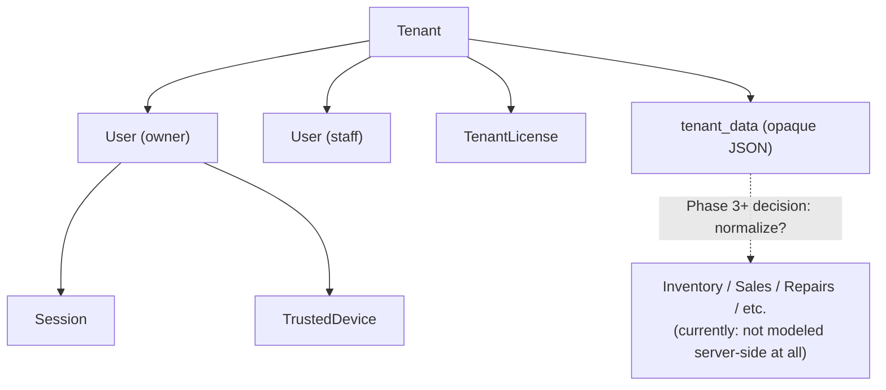
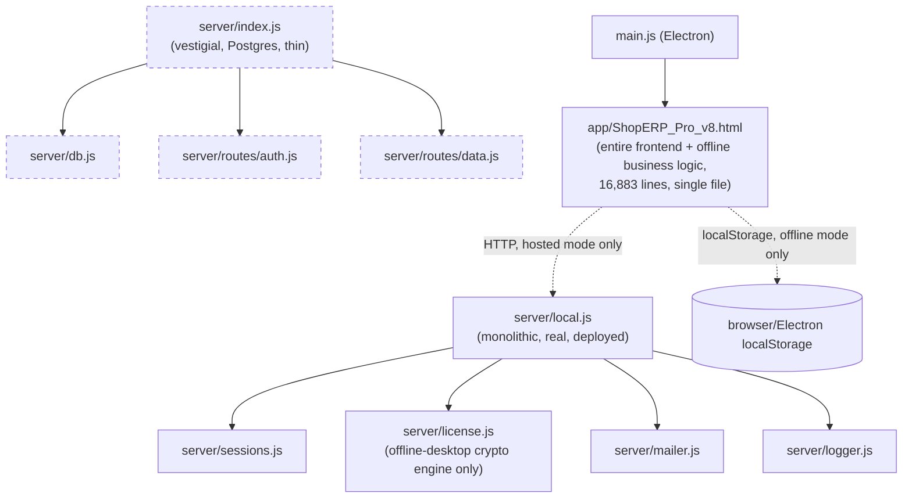

# Entity Relationships & Diagrams

Companion to `DomainModel.md`. Every diagram below reflects the actual current implementation (verified against code), not an idealized future design.

## Relationship table — every real relationship in the domain

| From | To | Cardinality | Ownership | Cascade | Reference integrity | Business meaning |
|---|---|---|---|---|---|---|
| Tenant | User | 1-to-many | Tenant owns User | `ON DELETE CASCADE` (never triggered — Tenant never deleted) | FK enforced (`foreign_keys=ON`) | A shop's staff and owner accounts |
| Tenant | TenantLicense | 1-to-1 | Tenant owns License | `ON DELETE CASCADE` | FK + `UNIQUE(tenant_id)` | A shop's subscription |
| Tenant | tenant_data | 1-to-1 | Tenant owns its data blob | `ON DELETE CASCADE` | FK, `tenant_id` is the PK | A shop's opaque business-data JSON (today) |
| Tenant | LicenseHistory | 1-to-many | Tenant owns its history | `ON DELETE CASCADE` | FK | Audit trail of licensing events |
| TenantLicense | SubscriptionPlan | many-to-1 | Plan is shared/global, not owned by any tenant | N/A (no cascade — plans aren't deleted) | FK (`plan_code REFERENCES subscription_plans(code)`) | Which tier a tenant is on |
| User | Session | 1-to-many | User owns Session | No FK-level cascade declared (`user_sessions` has no `FOREIGN KEY` constraint at all — enforced only in application logic) | **Not DB-enforced** | A user's active logins |
| User | TrustedDevice | 1-to-many | User owns TrustedDevice | `ON DELETE CASCADE` | FK | Devices a user has logged in from |
| Tenant | TrustedDevice | 1-to-many (denormalized) | — | `ON DELETE CASCADE` | FK | Fast tenant-scoped device queries without a User join |
| InventoryItem | SaleItem | 1-to-many (referenced by ID, not owned) | InventoryItem is independent; SaleItem references it | No cascade — Sale/SaleItem survive even if the InventoryItem is later deleted, since `productId`/`name`/`price` are snapshotted, not joined live | **Not DB-enforced** (no real database yet — this is a JS array relationship) | What was sold, at what price, at time of sale |
| InventoryItem | RepairJob (`partsUsed[]`) | many-to-many (via nested array, referenced by ID) | InventoryItem independent | Deleting a RepairJob restores parts-used quantity to InventoryItem.stock (application-level "cascade", not DB-level) | Not DB-enforced | Parts consumed by a repair |
| Customer | Sale | 1-to-many (referenced, not owned) | Customer independent | None — Sale keeps `customerName` even if Customer is later edited/deleted | Not DB-enforced | Who bought |
| Customer | RepairJob | 1-to-many (referenced) | Customer independent | Same as above | Not DB-enforced | Whose device |
| Sale | SaleItem | 1-to-many, **nested/embedded** | Sale fully owns its items (not a separate table/array at all) | Deleting a Sale would delete its items with it (though no delete function for Sale exists at all) | N/A — it's a JS object property, not a relational join | Line items of one transaction |
| RepairJob | Payment (value object) | 1-to-many, embedded `payments[]` | RepairJob owns its payment records | Embedded — no independent lifecycle | N/A | Partial/split payment collection |
| Sale | Payment (value object) | 1-to-many, embedded `payments[]` | Sale owns its payment records | Embedded | N/A | Partial/split payment collection |
| RecurringExpense | Expense | 1-to-many (generates, doesn't own) | Independent — generated Expense rows have no back-reference to the RecurringExpense that created them | None — no FK of any kind, not even an in-memory ID reference | **Not tracked at all** | "This month's rent" auto-entry |
| (nothing) | Purchase | — | — | — | — | **Does not exist — no relationship to document** |
| (nothing) | StockMovement | — | — | — | — | **Does not exist — InventoryItem.stock is mutated with no linked movement record** |

**The starkest pattern in this table**: every relationship in the **server** domain (top 6 rows) is a real, enforced SQL foreign key with `ON DELETE CASCADE` semantics. Every relationship in the **desktop/operations** domain (remaining rows) is an in-memory JavaScript array/object reference with zero database-level enforcement — because there is no database there at all yet. This is the single most important input for whichever future phase designs the Operations domain's MariaDB schema: it must decide, for the first time, what SQL-level referential integrity these relationships should actually have (e.g., should deleting an InventoryItem that has historical SaleItem references be blocked, restricted, or allowed with snapshot preservation, as today?).

## Entity Relationship Diagram — Server (Identity & Licensing)



## Entity Relationship Diagram — Desktop (Operations, no real database)

```mermaid
erDiagram
    CUSTOMER ||--o{ SALE : "buys (referenced by ID)"
    CUSTOMER ||--o{ REPAIR_JOB : "owns device in (referenced by ID)"
    SALE ||--|{ SALE_ITEM : "contains (nested, not a table)"
    SALE_ITEM }o--|| INVENTORY_ITEM : "snapshots price/name from"
    REPAIR_JOB }o--o{ INVENTORY_ITEM : "consumes parts from (nested partsUsed[])"
    RECURRING_EXPENSE ..> EXPENSE : "generates (no stored link)"

    CUSTOMER {
        int id PK
        string name
        string phone "soft-unique"
        string balance "dead field, never mutated"
    }
    SALE {
        int id PK
        string invoiceNo UK
        int customerId "no DB FK - JS reference only"
        array items "nested SaleItem[]"
        string status "does not exist - vestigial only"
    }
    SALE_ITEM {
        int productId "no DB FK - JS reference only"
        string name "denormalized snapshot"
        float price "denormalized snapshot, editable"
        int qty
    }
    REPAIR_JOB {
        int id PK
        string jobNo UK
        int customerId "no DB FK"
        string status "Received..Delivered, 5 states"
        array partsUsed "nested, references InventoryItem"
    }
    INVENTORY_ITEM {
        int id PK
        string sku "NOT actually unique"
        string imei "unique if present"
        int stock
    }
    EXPENSE {
        int id PK
        string category
        float amount
    }
    RECURRING_EXPENSE {
        int id PK
        string lastApplied "YYYY-MM stamp"
    }
```

Note: `PURCHASE`, `PURCHASE_ITEM`, `STOCK_MOVEMENT`, `CATEGORY`, `BRAND`, `SUPPLIER`, `QUOTATION`, `NOTIFICATION`, `REPORT` are intentionally absent from this diagram — they do not exist as entities (`DomainModel.md`).

## Bounded Context Diagram



**Note the dashed boundary**: `DesktopIdentity` is drawn separate from `Server/Identity` deliberately — they do not share a database, a session model, or even the same password-hashing algorithm. A "User" logged into the desktop app and a "User" row in the server's `users` table are not currently reconcilable as the same record for a hosted tenant using both — this is real, current technical debt (`CanonicalDomainModel.md`'s Technical Debt section), not a diagramming simplification.

## Domain-Specific Diagrams

### Authentication Domain (Server)



### Licensing Domain (Server)

See `LifecycleDiagrams.md` for the full state machine — this is the domain's most complex and most heavily documented lifecycle already (`docs/independent-audit/`, `docs/architecture-review/LicenseArchitecture.md`).

### Inventory Domain (Desktop)



### Sales Domain (Desktop)



### Repair Domain (Desktop)

Full lifecycle: `LifecycleDiagrams.md`. Relationship note: RepairJob has no technician-assignment field despite `technician` existing as a Role value — an assignment concept that's half-implemented (the role exists, the field to use it doesn't).

### Purchase Domain



### Tenant Ownership Diagram



### Module Dependency Diagram (current code, not the target architecture)



Dashed nodes are the vestigial Postgres skeleton — not part of the real, deployed dependency graph, kept only per `docs/adr/0002-mariadb-canonical-database.md` pending Phase 9's decommission.
