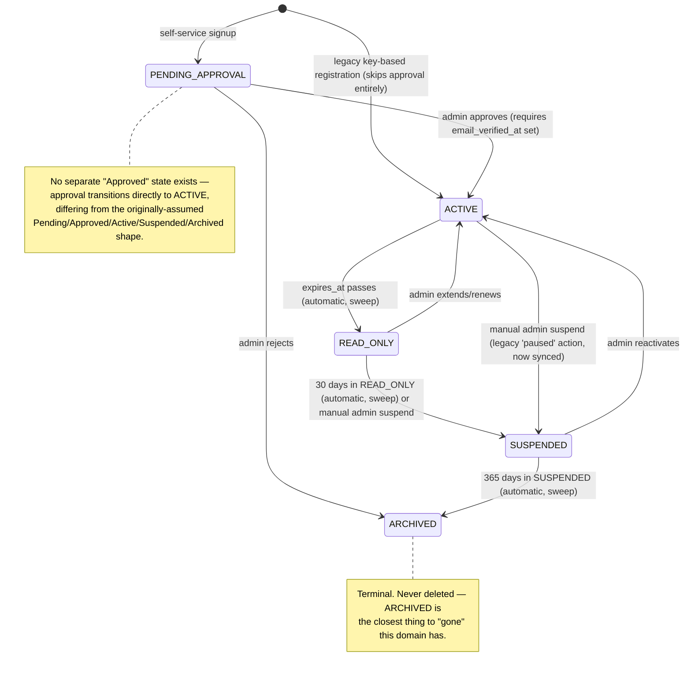
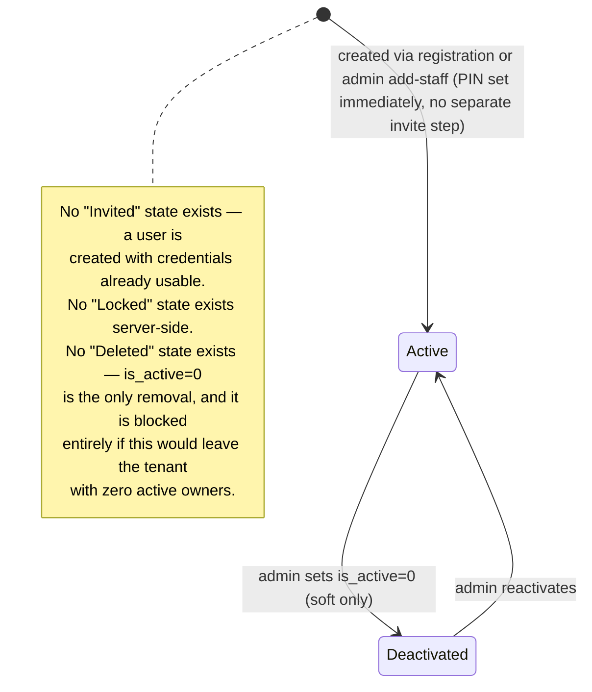
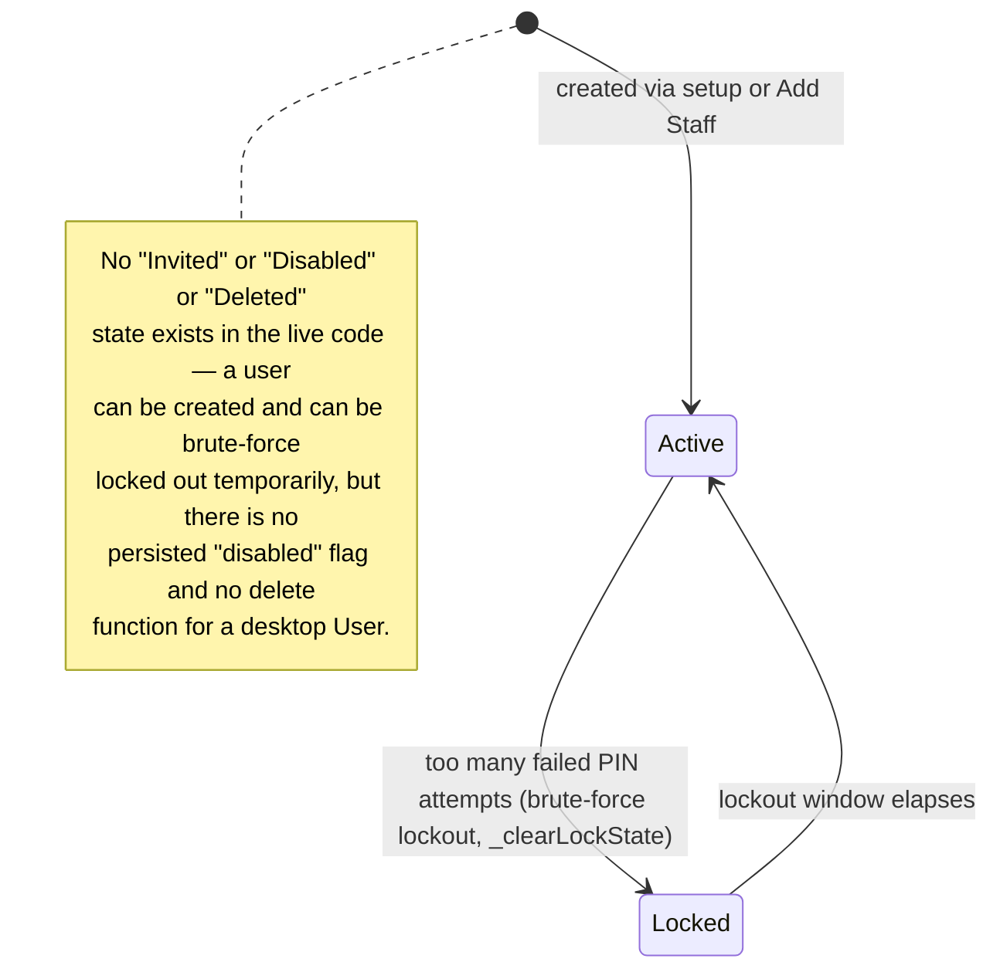
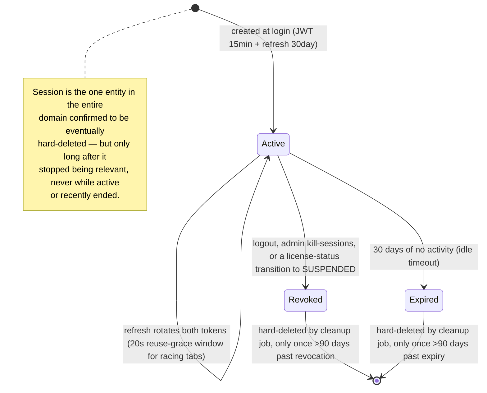
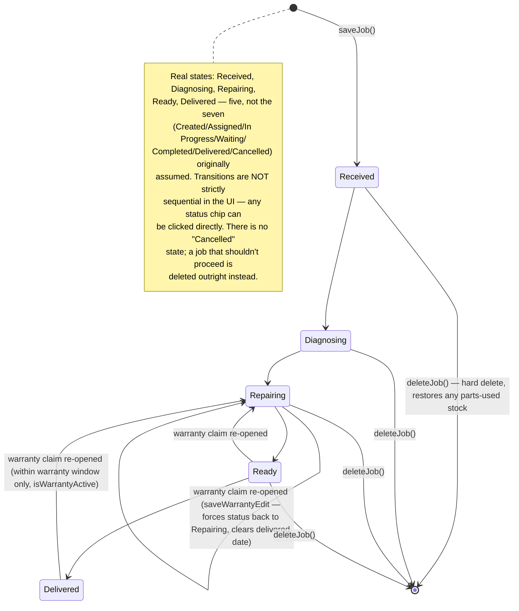
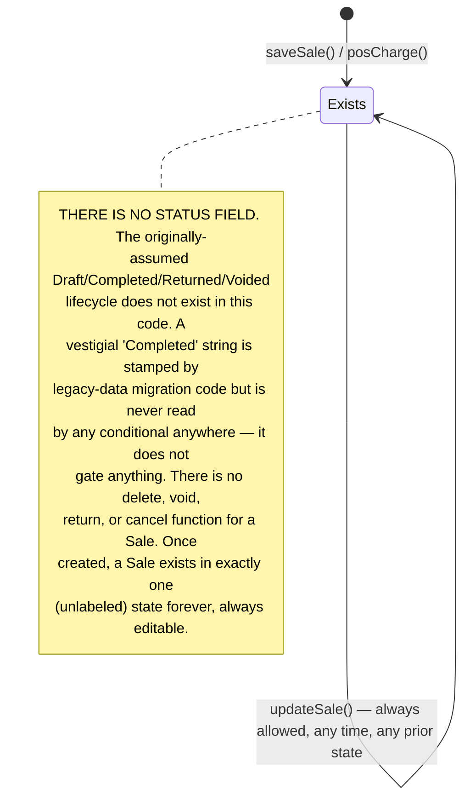
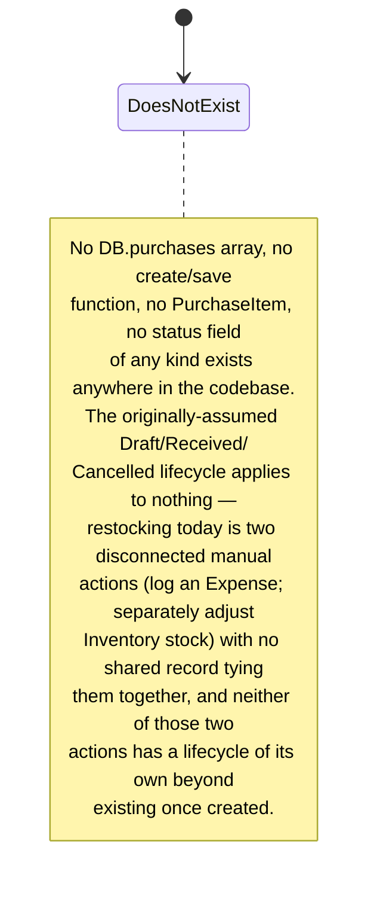

# Lifecycle Diagrams

Every diagram reflects the actual states and transitions found in the code. Where the originating mission assumed a lifecycle shape that doesn't match the implementation, the diagram shows the real one and a note explains the gap.

## Tenant

Two overlapping representations exist and are now kept in sync (`docs/independent-audit/FinalBlockerResolution.md`) — the authoritative one is `tenant_licenses.status`; the legacy `tenants.status` mirrors it.

**Legacy `tenants.status` mapping** (3-state, synced 1:1 onto the above): `active` ↔ `ACTIVE`/`READ_ONLY` (both map to legacy `active`), `paused` ↔ `SUSPENDED`, `terminated` ↔ `ARCHIVED`.

## User

### Server-side User

### Desktop User

**Gap vs. the originally-assumed model**: neither implementation has all five of Invited/Active/Locked/Disabled/Deleted — server has (Active, Deactivated); desktop has (Active, Locked-temporary). Documented as a real gap, not filled in with invented states.

## Session

## TenantLicense device/session interaction (not a separate lifecycle, but a real cross-entity effect)

Suspending a license (by any path — sweep or manual) always revokes every active Session for that tenant in the same operation. This is not modeled as a Session state of its own; it's a side effect of the TenantLicense transition above.

## RepairJob

## Sale — no lifecycle exists

## Purchase — no entity, therefore no lifecycle

## Summary — lifecycle completeness vs. the originating mission's assumptions

| Entity | Assumed lifecycle | Actual lifecycle | Match? |
|---|---|---|---|
| Tenant | Pending/Approved/Active/Suspended/Archived | PENDING_APPROVAL/ACTIVE/READ_ONLY/SUSPENDED/ARCHIVED | Close — no separate "Approved", has an extra READ_ONLY grace state |
| User | Invited/Active/Locked/Disabled/Deleted | Server: Active/Deactivated only. Desktop: Active/Locked(temporary) only | Partial — neither side has all 5 |
| Session | Created/Validated/Expired/Revoked | Active/Revoked/Expired, eventually hard-deleted after 90-day retention | Close match |
| License | Generated/Pending/Active/Expiring/Grace/Suspended/Archived | PENDING_APPROVAL/ACTIVE/READ_ONLY/SUSPENDED/ARCHIVED (5, not 7) | Partial — "Expiring"/"Grace"/"Generated" aren't distinct persisted states; READ_ONLY is the closest analog to a grace period |
| Repair | Created/Assigned/In Progress/Waiting/Completed/Delivered/Cancelled | Received/Diagnosing/Repairing/Ready/Delivered (5, not 7) | Partial — no Assigned/Waiting/Cancelled; delete replaces cancel |
| Sale | Draft/Completed/Returned/Voided | **No status field exists at all** | No match — the assumed lifecycle doesn't exist |
| Purchase | Draft/Received/Cancelled | **No entity exists** | No match — nothing to have a lifecycle |
