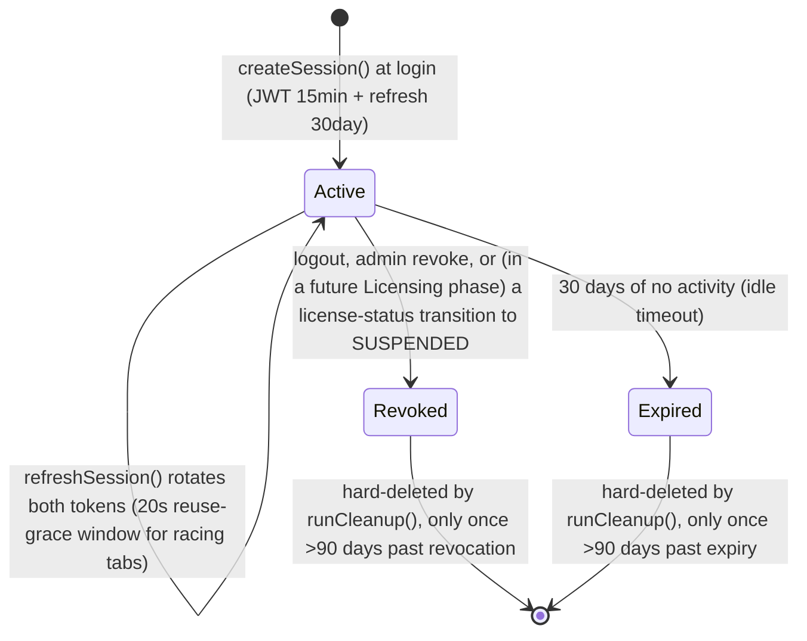

# Session Lifecycle — Identity & Tenant Core (Phase 2)

Mirrors `server/sessions.js` exactly. See `docs/architecture/LifecycleDiagrams.md` (Phase 1.5) for the original state diagram — reproduced and re-verified here against the actual new implementation.

## Constants (verified identical to `sessions.js` by `regression.test.js`)

| Constant | Value |
|---|---|
| Access token TTL | 15 minutes |
| Refresh token TTL / idle expiry | 30 days |
| Multi-tab refresh grace window | 20 seconds |
| Hard-delete retention (past revoked/expired) | 90 days |

## Refresh-token rotation, precisely

Every `POST /api/auth/refresh` call rotates BOTH the access token and the refresh token — the presented refresh token is invalidated the moment it's used. A **20-second grace window** exists specifically for two browser tabs sharing `localStorage` racing to refresh around the same 15-minute boundary: the "losing" tab's already-rotated-away token is still accepted if presented within 20 seconds of the winning tab's rotation, but only receives a fresh *access* token (`refreshToken: null` in the response) — it never gets to rotate the refresh token a second time. This exact mechanic, including the `null` refreshToken contract, is reproduced in `services/sessionService.js` and verified by `server/src/tests/sessionService.test.js`'s grace-window test.

## Device-scoped session tracking

`user_sessions.device_id` exists (nullable, unindexed beyond what Phase 1's schema already had) but is not yet populated by anything in Phase 2 — matching `local.js`'s own comment ("Wave 2 (Trusted Devices) will extend this column's usage") that this linkage was always intended as a later refinement, not a Phase 2 requirement.

## Cleanup job

Scheduled exactly like `local.js`'s `_runSessionCleanup()`: run once at boot, then every 30 minutes (`app.js`'s `SESSION_CLEANUP_INTERVAL_MS`). `createApp({..., startCleanupJob: false})` skips this — used by tests that don't want a background timer outliving them.
