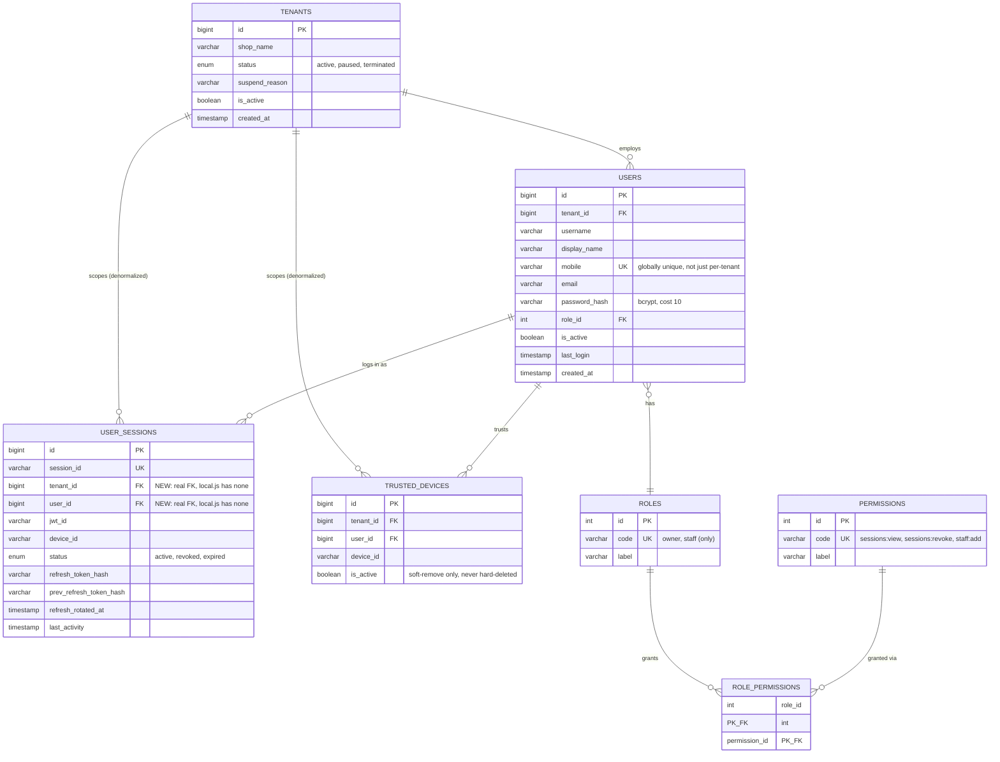

# Entity Relationship Diagram — Identity & Tenant Core (MariaDB, Phase 2)

Scope: exactly the 6 tables `migrations/001_identity_tenant_core.sql` creates. See `docs/architecture/CanonicalDomainModel.md` and `docs/architecture/EntityRelationship.md` (Phase 1.5) for the full cross-product domain model this is a real, implemented subset of.

## Deliberate deviations from `local.js`'s actual SQLite schema

1. **`users.role_id` (FK) replaces `users.role` (free TEXT)** — normalizes the existing 2-value enum (`owner`/`staff`) into a real reference table. No new role value is introduced; this cannot change who can log in as what.
2. **`user_sessions.tenant_id`/`user_id` gain real foreign keys.** `local.js`'s SQLite table declares none (confirmed in `docs/architecture/EntityRelationship.md`, Phase 1.5 — "enforced only in application logic"). A session row is never created for a nonexistent tenant/user in current logic, so this constraint only ever rejects states that were already unreachable — a hardening, not a behavior change.
3. **`roles`/`permissions`/`role_permissions` are new tables with no `local.js` equivalent at all** — see `docs/adr/0006-table-driven-authorization.md`.

## Deliberately excluded (out of scope, not an oversight)

`tenant_licenses`, `license_history`, `subscription_plans`, `admin_credentials`, `cloud_backups` — Licensing and Administration domains, explicitly out of scope for Phase 2 (`docs/database/MigrationNotes.md`). `tenants.license_key_hash`/`license_expiry`/`license_plan` — present on `local.js`'s `tenants` table today, but Licensing-domain data that happens to live there historically, not carried into this schema.
